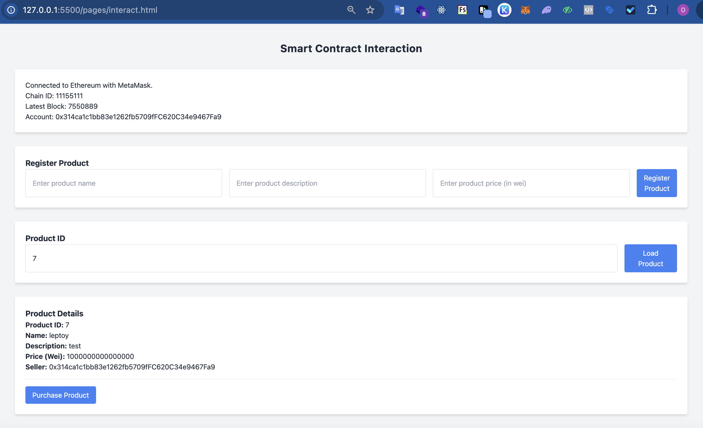

## Deployed Smart Contracts

[0x70Ff98638f4a239e1b685B646b77Ad8d650B6999](https://sepolia.etherscan.io/address/0x70Ff98638f4a239e1b685B646b77Ad8d650B6999)

## Guide

### Deployment & Interact test

- `npm i`
- `node ./scripts/compile.js`

  > Compile smart contracts, output berupa `/contracts/MarketplaceBytecode.json` dan `/contracts/MarketplaceAbi.json`

- `node ./scripts/index.js`

  > Deploy smart contracts, output akan ada di `/contracts/MarketplaceAddress.json`

- `node ./scripts/deploy.js`

  > Deploy smart contracts, output akan ada di `/contracts/MarketplaceAddress.txt`. kita bisa cek di [etherscan](https://sepolia.etherscan.io/) dengan memasukkan address yang ada di file tersebut.

- `node ./scripts/interact.js`

  > Interact dengan smart contracts, output berupa `console.log` dari hasil interaksi.

### Interact from frontend

- install metamask extension: https://metamask.io/download/
- host file `index.html` di localhost, bisa menggunakan `live-server` atau `http-server`
- buka browser, buka console, dan coba interact dengan smart contracts
  
